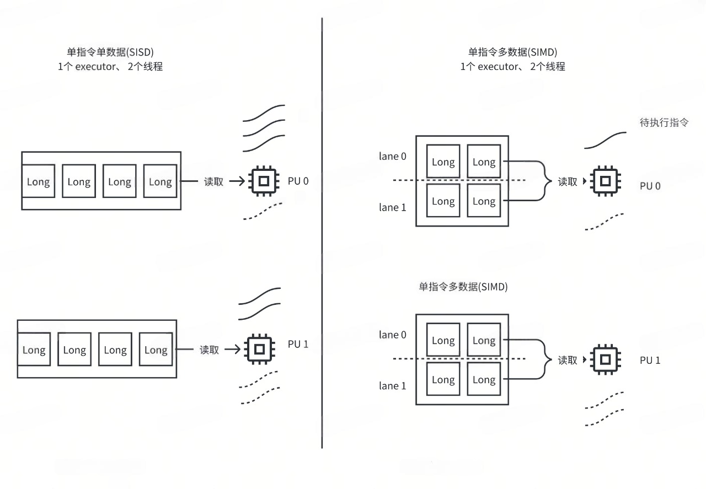
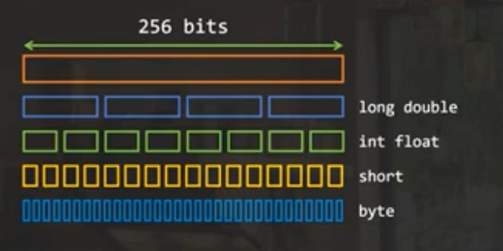
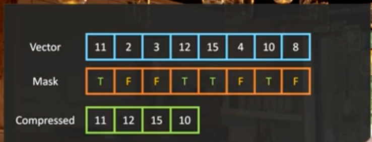

# Java 向量化知识

Java VectorAPI 利用 SIMD 指令来提升计算性能。

## 1. CPU 工作机制
CPU 分为多个计算核心(core, PU), 每个核心干的工作就是 周期性的执行指令，因此一条指令 执行时间就是一个周期（CPU cycle）。

CPU 有不同架构，不同架构的 CPU 支持的 指令集不同。

有几种矢量指令集支持 **一条指令处理多条数据（SIMD）**：

- AVX2：一条指令能处理 256-bit宽度的数据，e.g. 4 个 Long 类型
- AVX512：一条指令能处理 512-bit宽度的数据，e.g. 8 个 Long 类型

区别于多核多线程：

- Spark 中 executor 有多个 core，每个core 分配一个 task 线程
- 而 SIMD 是在线程内优化，每个线程的 一条指令（一个 core 上运行）会处理多条数据。

如下图所示，

* SISD: 处理4条数据需要 4 条指令
* SIMD: 处理4条数据只需要 2 条指令，因为一次处理两条

  

## 2. SIMD 产生计算收益的来源？
程序底层看，每一行代码对应于多个 CPU 指令，每条指令执行所消耗的时间 用 CPU cycle 来衡量。

SIMD 是相对于 SISD 而言，SISD 是单指令处理单条数据，SIMD 是单条指令处理多条数据。

直观解释就是，本来处理多条数据需要多条指令、需要消耗多个 cpu cycle；由于对这些数据的处理都是一样的，并且底层指令支持用一条执行处理多条数据，因此，就能达到只用一个 cpu cycle 处理多条数据的目的。

因此，使用 SIMD 指令不存在浪费一说，只是将计算单元的算力最大化使用了。

## 3. SIMD 中的 M 究竟是多少？
一条指令究竟能处理多少条数据呢？这个取决于你的 CPU 支持的**指令寻址宽度**，JDK Vector API 支持在 Runtime 获取这个宽度(SPECIES_PREFERRED)可以
示例代码：
```java
var species = IntVector.SPECIES_PREFERRED;
for (int index=0;
        index < v1.length;
        index += species.length()) {
    var V1 = IntVector.fromArray(species, v1, index);
    var V2 = IntVector.fromArray(species, v2, index);
    var RESULT = V1.add(V2);
    RESULT.intoArray(result, index);
}
```
  

在 JDK 的 Vector：SPECIES 指的是 CPU 支持的宽度 除以 Vector 中单个元素的大小

## 4. SIMD 如果 M 不是 8 byte 整数倍(not align)怎么办？
自适应的方法是：使用 Vector Mask 
示例代码：
```java
for (int index=0;
     index < v1.length;
     index += species.length()) {
    var mask = species.indexInRange(index, v1.length);
    var V1 = IntVector.fromArray(
        species, v1, index, mask);
    var V2 = IntVector.fromArray(
        species, v2, index, mask);
    var RESULT = V1.add(V2, mask);
    RESULT.intoArray(result, index, mask);    
}
```
**Caveat**:  performance downgrade when the Vector Mask is not supported by machine

万金油方法（虽然不够简洁），下述方法比 “在 CPU 不支持 Vector Mask 情况下用 Mask” 性能好
```java
var species = IntVector.SPECIES_PREFERRED;
int index = 0;
for (; index < species.loopBound(v1.length);
        index += species.length()) {
     var V1 = IntVector.fromArray(species, v1, index);
     var V2 = IntVector.fromArray(species, v2, index);
     var RESULT = V1.add(V2);
     RESULT = intoArray(result, index);       
}

for (int index2 = index; index2 < v1.length; index2++) {
    result[index2] = v1[index2] + v2[index2];
}
```

## 5. 概念解析：lane、classic for loop

Jdk SMID Vector 中的每个元素叫做 lane（车道），这个用于形象化描述数据“流过”指令的情形。
对 Vector 中元素的操作分为：

- lane-wise operation：独立对每个lane上的元素计算，类似 spark 中的 map 操作，比如两个 Vector 对应位置相加、单个 Vector 每个元素 +1 等操作
- cross-lane operation：计算的时候用到不同 lane（Vector中的元素）。类似 spark 中的聚合操作，比如 求 sum/min/max/norm，sort 一个 vector 中的元素

对于没有利用到 SIMD 优化的循环：classic for loop

## 6. 例子：计算 Norm

$$
norm = sqrt(sum(x_i^2))
$$

计算拆解

* $x_i^2$: lane-wise operation
* $Sum$: cross-lane operation

CPU 支持 Vector Mask 的写法：

- 先 lane-wise 求平方和
- 再 cross-lane 求 partial sum
- 遍历完所有元素后，就完成了计算
```java
double sum = 0d;
for (int index = 0;
    index < v.length;
    index += species.length()) {
 var mask = species.indexInRange(index, v.length);
 var V = IntVector.fromArray(
     species, v, index, mask);
 var V2 = V.mult(V, mask);
 sum += V2.reduceLanes(VectorOperators.ADD, mask);
}

double norm = Math.sqrt(sum);
```
ToDo：思考🤔 如何写 CPU 不支持 Vector Mask 的场景

另一种写法：

- 先 lane-wise 求平方和
- 在 lane-wise  add 操作
- 直到遍历完所有元素后， cross-lane 求sum

```java
double sum = 0d;
var V3 = IntVector.zero(species);
int index = 0;
for(; index < species.loopBound(v.length);
    index += species.length()) {
  var V = IntVector.fromArray(species, v, index);
  var V2 = V.mult(V);
  V3 += V3.add(V2);   
}

double sum = V3.reduceLanes(VectorsOperators.ADD);
for(; index < v.length; index) {
    sum += v[index]*v[index];
}
double norm = Math.sqrt(sum);
```

## 7. 例子：计算 average
```java
double sum = 0d;
for(int index = 0;
    index < v.length;
    index += species.length()) {
  var mask = species.indexInRange(index, v.length);
  var V = IntVector.fromArray(
      species, v, index, mask);
  sum += V2.reduceLanes(VectorsOperators.ADD, mask);
}
double average = sum / v.length;
```

Cross-lane 操作通过传递 VectorsOperators.XXX 给 reduceLanes 方法实现 VectorsOperators.XXX 包括：

- ADD, MULT, MIN, MAX, some boolean or bitwise operation
- 这些操作都是和汇编指令 一一对应的， 所以不支持传递 lambda 表达式

## 8. 例子：filter reduce，先过滤，再计算
下面是在 支持 Vector Mask 的CPU上的代码（也可以自己实现不支持 Mask 的逻辑）：
```java
int[] result = new int[v.length];
int maxIndex = 0;
for (int index = 0;
    index < v.length;
    index += species.length()) {
     var mask = species.indexInRange(index, v.length);
     var V = IntVector.fromArray(
         species, v, index, mask);
      // 返回一个 Vector，指示哪个元素pass the test
      // 此处的 mask 没法使用其他方式实现。
     var cmp = V.compare(VectorOperators.GT, limit, mask); 
     // copy compressed vector to your array, at the position that you
     // need to increment in each loop
     V.compress(cmp).intoArray(result, maxIndex);
     maxIndex += cmp.trueCount();
}
```

或者直接计算结果，不用存储 filtered 结果
```java
int[] result = new int[v.length];
int maxIndex = 0;
for (int index = 0;
    index < v.length;
    index += species.length()) {
     var mask = species.indexInRange(index, v.length);
     var V = IntVector.fromArray(
         species, v, index, mask);
      // 返回一个 Vector，指示哪个元素pass the test
      // 此处的 mask 没法使用其他方式实现。
     var mask2 = V.compare(VectorOperators.GT, limit, mask); 
     sum += V.reduceLanes(VectorOperators.ADD, mask2);
     count += mask2.trueCount();
}
double average = sum / count;
```

Vector 的 compress 操作：

- 是一个 cross-lane 操作
- 删除 mask 为 false 的元素。如下
  


## 9. 最佳实践
大多数时候，只需要优化 外层循环即可

- Copy array into a vector, chunck by chunck
- Compute in parallel over Vector lane

## 10. C2 编译器，可以不用改 Java 代码就能自动用到 SIMD 优化，free performance

## 11. 典型应用场景

- Array comparisons
- string conversions from one charset to another

## Ref
[Learn how to write fast Java code with the Vector API]: https://www.youtube.com/watch?reload=9&app=desktop&v=42My8Yfzwbg
[Examples, patterns and performances]: https://github.com/openjdk/jdk/tree/master/test/micro/org/openjdk/bench/jdk/incubator/vector
[JEP 438: vector API]: https://openjdk.org/jeps/438
[Vector API in JDK 17]: https://www.youtube.com/watch?v=1JeoNr6-pZw&t=0s
[Dev.java]:  https://dev.java
[Inside.java]: https://inside.java
[JDK 20]: https://openjdk.org/projects/jdk/20
[OpenJDK]: https://openjdk.org
[Oracle Java]: https://www.oracle.com/java/
[Java magazine 介绍 simd]: https://blogs.oracle.com/javamagazine/post/java-vector-api-simd   
[AVX2]: https://blog.csdn.net/mutourend/article/details/100074798
[AVX2]: https://zh.wikipedia.org/zh-hans/AVX%E6%8C%87%E4%BB%A4%E9%9B%86
[AVX、SSE 混用变慢]: https://www.zhihu.com/question/37230675
[Avx 512]: https://en.wikipedia.org/wiki/AVX-512

4. [Learn how to write fast Java code with the Vector API]
      1. [Examples, patterns and performances]
      2. [JEP 438: vector API]
      3. [Vector API in JDK 17]
      4. [Dev.java]
      5. [Inside.java]
      6. [JDK 20]
      7. [OpenJDK]
      8. [Oracle Java]
     
5. [Java magazine 介绍 simd]
6. CPU 指令集 AVX
     1. [AVX2]
     2. [AVX2]
     3. [AVX、SSE 混用变慢]
     4. [Avx 512]