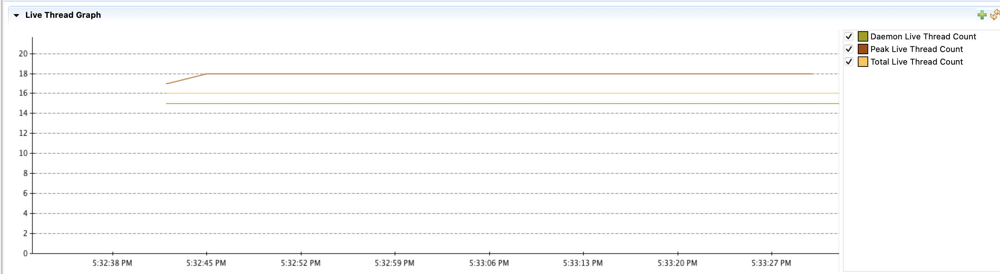
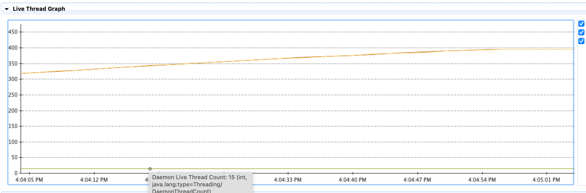

# A Tour of Learning Thread Leak

## key takeaways（要点）
* 什么是线程泄露，为什么会线程泄露：线程未正常退出，导致资源泄露、调度开销。
* 排查线程泄露的一种方法：JVM 中不断新增线程数量、没有线程释放（或极少）。
* Java 问题排查工具：JFR（收集程序运行状态的 event）、JDK Mission Control（可优化分析 jfr 日志）


## 线程泄露的简介
想必大家都听过**内存泄露**，简单来说就是，用户申请的一块内存，因为无法被系统回收而不能再被重复利用；危害是可能导致程序报错 OutOfMemory(OOM)。

笔者此前还没听说过 **线程泄露** 这一概念。实际上，它和内存泄露类似，就是指，一个用户申请的线程因无法被回收而不能重复利用。线程占用 stack memory、线程中的对象又占用 heap memory，因此，线程泄露也是一种形式的内存泄露。被泄露的线程无法关闭，也会让操作系统产生**调度开销（如Context Switch等消耗cpu等）**；如果有大量的线程泄露，会导致操作系统将cpu资源消耗殆尽。

talk is cheap, show me the code! 上代码
```java

1. ExecutorService executor = Executors.newFixedThreadPool(10);

2. List<String> getCommonFriends() throws ExecutionException, InterruptedException = {
3.    Future<List<String>> johnFriendsFuture = executor.submit(() -> getFriends("John"));
4.    Future<List<String>> bobFriendsFuture = executor.submit(() -> getFriends("Bob")); 

5.    List<String> johnFriends = johnFriendsFuture.get(); //Join
6.    List<String> bobFriends = bobFriendsFuture.get(); //Join 

7.    return commonFriends(johnFriends, bobFriends);
8. }
```

快问：前面这段代码可能在哪里发生线程泄露呢？

快答：LOC 6（第六行）。 LOC 3、4 提交两个 task 到线程池中，对应两个线程。当 LOC 5 抛异常后，LOC 4 提交的 task 一直占用着一个线程，无法被释放。


## 问题复现
> 系统方法论: 解决问题的第一步是复现问题。

如果线上发生了异常，如何确定是否是线程泄露呢？🤔 

这里我们先复现一下线程泄露，然后看有什么现象。

具体的代码实现参考 <a href="#list1"> 文章后面的 Code List 1</a>。代码核心逻辑是

* 利用一个循环，反复调用前述代码示例中的 `getCommonFriends()` 函数，
* 同时, 让 `getCommonFriends()` 函数中 LOC 5 抛异常，模拟线程泄露

在运行程序时，给 JVM 加上一个 JFR (Java Flight Record) 参数, `-XX:StartFlightRecording:filename=recording.jfr,duration=1s`，从而收集 Java 程序运行时的一些事件，以便于后期分析。 当然，JFR 也支持 attach 到一个正在运行的 Java 程序上。

* 指定 jfr 生成的日志文件：`filename=recording.jfr`
* 指定 jfr 收集日志的评率：`duration=1s`

在程序运行时，可以通过 JDK Mission Control (JMC) 工具**实时观察**程序运行情况。

下图是**没有线程泄露**时，VM中活跃的线程数目随时间的变化。可以看到，申请的线程数目有个短暂的增加，然后保持不变了。因为虽然有新的 task 不断被提交到 thread pool，但是旧的 task 完成退出后线程资源就被释放了。

  

下图是**有线程泄露**时的，VM 中活跃的线程数目随时间的变化：可以看到，申请的线程数目一致处于增长，而且远远大于前一幅图（task计算逻辑都是一样)。因为先提交的 task 没有没有正常退出，导致线程资源不能被释放，每次新的 task 被提交又会申请线程资源。

 


可以用 JMC 打开 JFR 日志，在 Event Browser 中的 [jdk.JavaThreadStatistics](https://bestsolution-at.github.io/jfr-doc/openjdk-17.html#jdk.JavaThreadStatistics) 查看，会发现线程数量一直在增长。如下图


## 总结
**线程泄露** 是由于线程未正常终止，导致资源无法被释放。通过 JFR 日志可以看到，Java 应用一直在申请线程、而没有线程释放。


## Ref
* [Finding Java Thread Leaks With JDK Flight Recorder and a Bit Of SQL]
* 更多 JFR 相关问题
    * [JFR导致雪崩](https://heapdump.cn/article/2068590)


[Finding Java Thread Leaks With JDK Flight Recorder and a Bit Of SQL]: https://www.morling.dev/blog/finding-java-thread-leaks-with-jdk-flight-recorder-and-bit-of-sql/


## Code List

### List 1. <a name='list1'></a>

```java
    public static Set<Integer> getFriends(Integer employId) {
        if (employId % 2 == 0) {
            //示例1: thread Leak
            throw new RuntimeException();
//             示例2: graceful exit
//            return new HashSet<>(){{
//                add(employId / 3);
//            }};
        } else {
            return new HashSet<>() {{
                    add(employId / 3);
                    add(2 * employId / 2);
            }};
        }
    }

    private static final Logger logger = LoggerFactory.getLogger(App.class);

    static Set<Integer> getCommonFriends(Integer employId1, Integer employId2)
            throws ExecutionException, InterruptedException {
        ExecutorService executor = Executors.newFixedThreadPool(2);

        Future<Set<Integer>> johnFriendsFuture = executor.submit(() -> getFriends(employId1));
        Future<Set<Integer>> bobFriendsFuture = executor.submit(() -> getFriends(employId2));

        Set<Integer> johnFriends = johnFriendsFuture.get(); //Join
        Set<Integer> bobFriends = bobFriendsFuture.get(); //Join

        johnFriends.retainAll(bobFriends);

        executor.shutdown();
        return johnFriends;
    }


    public static void main(String[] args) throws ExecutionException, InterruptedException {
        HashMap<Integer[], Set<Integer>> lookUpTable = new HashMap<>();
        for (int i = 0; i < 20; i++) {
            for (int j = i + 1; j < 20; j++) {
                try {
                    Thread.sleep(i*100);
                    getCommonFriends(2*i, 2*j + 1);
                } catch (Exception e) {
                    logger.error("get friends failed!", e);
                }
            }
        }
    }

```